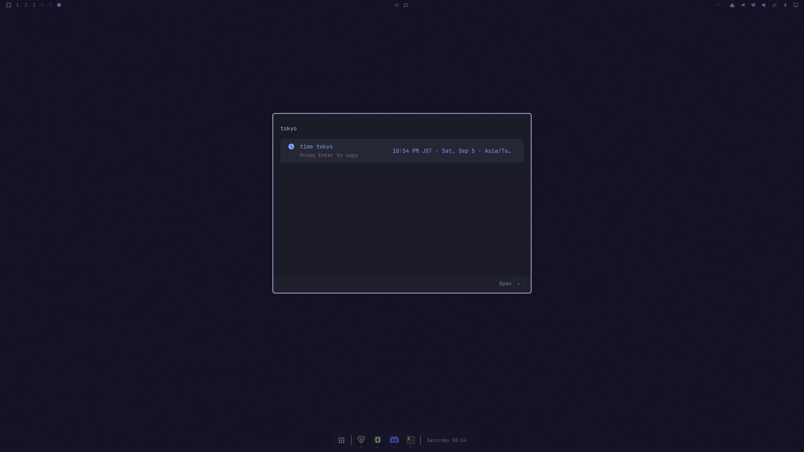
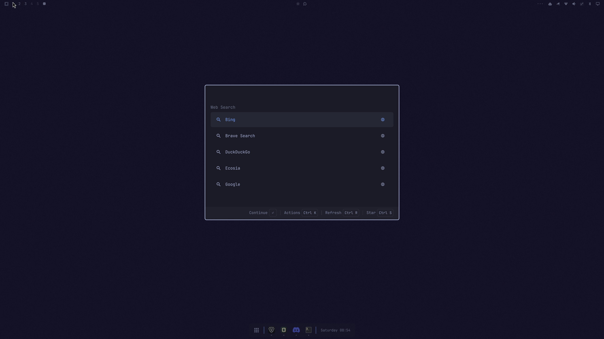
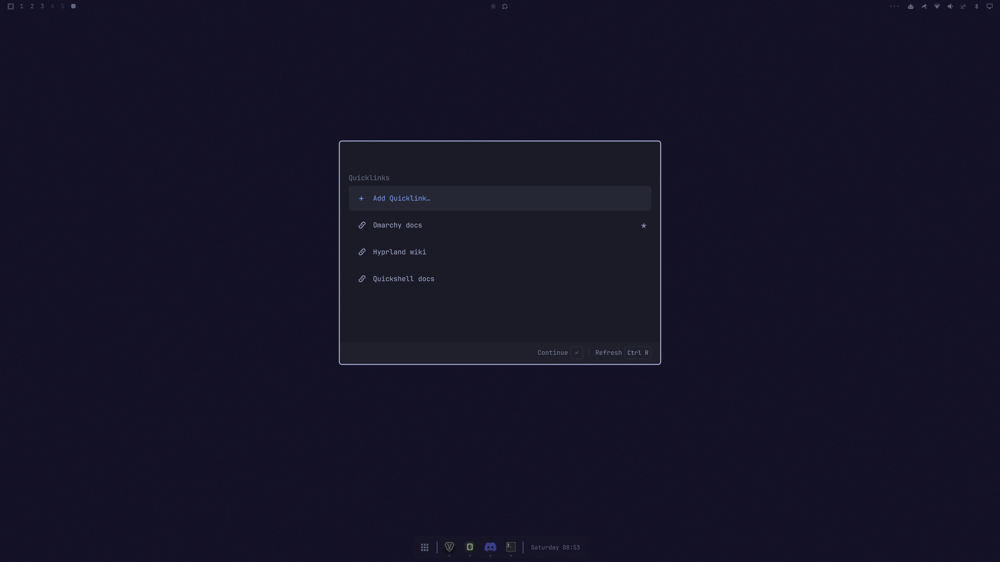
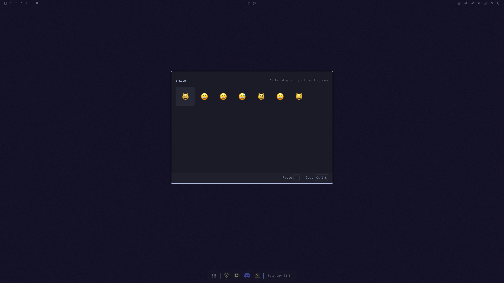
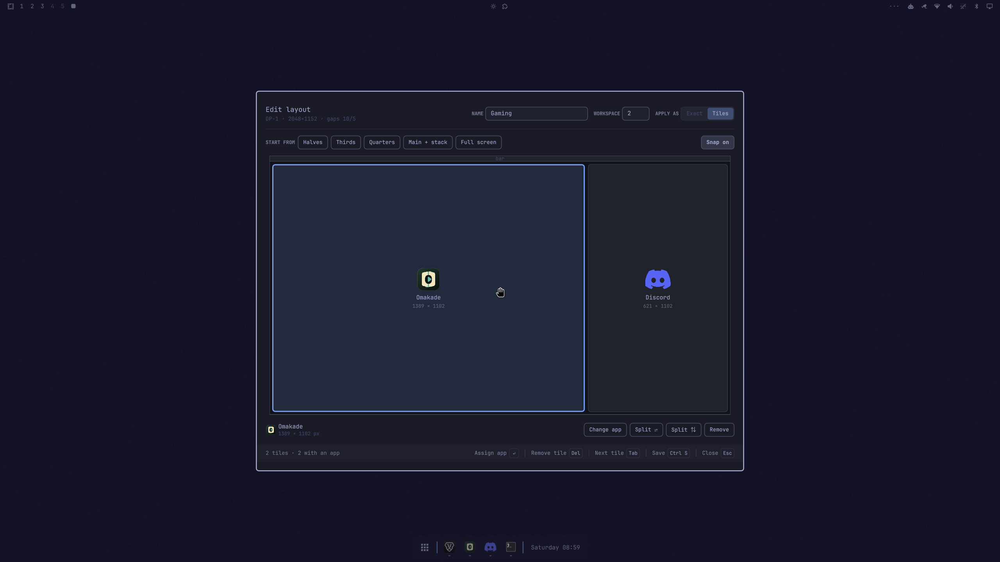

# Omalaunch

An extensible command launcher for [Omarchy](https://omarchy.org/).

Omalaunch keeps the familiar Omarchy command tree while adding fast global search, application results, favorites, usage-aware ranking, calculations and conversions, and independently installable extensions.


> This is a fork of [daniellemky/omalaunch](https://github.com/daniellemky/omalaunch)
> maintained by [cpreston321](https://github.com/cpreston321), tracking upstream
> and adding features on top of it — user-installed extensions dropped into
> `~/.config/omarchy/omalaunch/extensions.d/` with no plugin around them, an
> `action` extension mode, clipboard history, the emoji picker, a fixed
> launcher size, and switching a capability off from the launcher. See
> [Additions in this fork](#additions-in-this-fork). Extension authoring is
> documented in [EXTENSIONS.md](EXTENSIONS.md). The installation commands below
> point at this fork; use the upstream URL if you want the original.

## Installation

### From the Omarchy menu

1. Open **Setup › Plugins › Add Plugin**.
2. Enter `https://github.com/cpreston321/omalaunch` as the Git URL.
3. Review and confirm Omarchy’s plugin trust warning.
4. Confirm that you want to enable Omalaunch.
5. Choose **left** when prompted for a bar section.

### From a terminal

```bash
omarchy plugin add https://github.com/cpreston321/omalaunch --enable
```

Review and confirm the plugin trust warning, then choose **left** when prompted for a bar section.

Enabling Omalaunch replaces Omarchy’s default clickable launcher icon and routes the existing Super+Space shortcut to Omalaunch. Disabling or removing the plugin restores the default Omarchy launcher. No calculation dependency needs to be installed before adding the plugin; Omalaunch offers explicit setup from its starting view when needed.

Click the launcher icon or press Super+Space to open Omalaunch. Right-clicking the icon opens a terminal.

Current Omarchy versions can select a bar section during installation but not an exact index. If the launcher icon appears after the workspace buttons, move it to the first position with:

```bash
omarchy bar move quantumfire.omalaunch --section left --index 0
```

This workaround can be removed once Omarchy supports setting a widget’s section and index during plugin installation.

## Features

- Search the complete Omarchy command tree and installed applications
- Star favorites and rank frequently used results
- Run arithmetic, unit conversions, and currency conversions with `qalc`
- Copy calculation results directly to the clipboard
- Browse, recursively search, open, copy paths, and star local files and directories
- Look up current times and convert times across DST-aware timezones
- Search a grid of emoji and paste one straight into the focused application
- Browse, search, and paste clipboard history with a detail pane
- Save, open, star, and edit web links with Quicklinks
- Search with Google, DuckDuckGo, Bing, Brave Search, or Ecosia
- Accept dmenu-style select and input requests
- Load extensions contributed by enabled Omarchy plugins, or dropped into
  `~/.config/omarchy/omalaunch/extensions.d/` without a plugin around them
- Scaffold a new extension with your default coding agent from **Add Extension**
- Launch agent prompts such as Pi and Codex through optional extensions

## Starred favorites

Star frequently used applications, commands, files, directories, and extension shortcuts on the launcher’s starting view. Matching starred items rank above unstarred search results, and starred files and directories are searchable by name or path-component prefix. Search then ranks by text-match quality, usage count, recent use, and a stable fallback; result type does not change the text-match tier.


## Calculator

Evaluate arithmetic, units, and currency conversions without leaving the launcher. The result row reads as a ledger line: the expression on the left, the answer right-aligned and larger in the theme's accent colour. Press Enter to copy it.

Currency answers are shown the way money is written — amount first, two decimals, grouped thousands — so `10 usd to cad` gives `13.89 CAD` rather than `CAD 13.89019350`. Unit answers are tidied the same way: `180 lbs to kg` gives `81.65 kg` rather than `81.6466266 kg`. A value below one keeps four significant digits instead, so `1.5 L to gal` gives `0.3963 gal` rather than being flattened to `0.4`. What is shown is what gets copied.

Everyday spellings work, not just the ones `qalc` accepts. `qalc` reads an abbreviated plural as the singular times seconds and a bare temperature letter as a physics constant, so `180 lbs to kg` used to answer `81.65 kg·s` and `100 c to f` used to answer `2.99e25 fm/s`. Those are rewritten before evaluation, and the expression shown is the rewritten one, so you can see what was actually computed:

| you type | evaluated as | answer |
| --- | --- | --- |
| `100 c to f` | `100 °C to °F` | `212 °F` |
| `300 k to c` | `300 K to °C` | `26.85 °C` |
| `180 lbs to kg` | `180 lb to kg` | `81.65 kg` |
| `60 kmh to mph` | `60 km/h to mph` | `37.28 mph` |
| `3 tsps to ml` | `3 tsp to ml` | `15 mL` |

`ms`, `ns`, and `ps` are left alone, being real units, and a bare `c`, `f`, or `k` is only read as a temperature when both sides of the conversion are — so `500 ms to s` and `3 c to m` mean what they say.

An amount and a unit on their own convert to the obvious counterpart, so you rarely need to type the target:

| you type | you get |
| --- | --- |
| `1 inch` or `1inch` | `2.54 cm` |
| `80 kg` | `176.37 lb` |
| `5 km` | `3.11 mi` |
| `6 ft` | `182.88 cm` |
| `2 cups` | `480 mL` |
| `100 celsius` | `212 °F` |
| `60 mph` | `96.56 km/h` |

Naming a target always wins, so `1 inch to mm` converts to millimetres. A one-letter unit has to be separated from the amount — `500 g` converts, `5g` stays a search — which is what keeps `4k`, `1080p`, and `1password` out of the calculator.


## Currency conversion

Convert currencies inline using `qalc` exchange-rate data. Press Enter to copy the result.


## Timezones

Type `time` to select the bundled Timezone extension. Look up the current time with queries such as `time seattle` or convert a specific time with `time 9am winnipeg to tokyo`. Dates are optional, city aliases and IANA timezone names are supported, and conversions account for daylight-saving time.

```text
time seattle
time 9am winnipeg to tokyo
time 2026-11-15 8pm new york to london
```



## Web Search

Open **Web Search**, select a search engine, enter a query, and press Enter. Omalaunch opens the encoded search in your default browser. Each engine can be added to or removed from global search while it remains available in the Web Search menu. Press Ctrl+S to star an engine on the launcher's starting view. Press Ctrl+, in Web Search to create and edit `~/.config/omarchy/omalaunch/extensions/omalaunch.web-search.jsonc` with the default editor or coding agent. Add, replace, or remove engines there; see [PROVIDER-CONFIGURATION.md](PROVIDER-CONFIGURATION.md).



## Quicklinks

Save web links and open them from the launcher. **Quicklinks** lists everything
you have saved; typing part of a name finds it, and Enter opens it in your
default browser. The `links` prefix jumps straight there.

**Add Quicklink…** asks for a URL and then a name. Ctrl+K on a saved link opens
its actions: star it so it appears on the starting view, copy the URL, edit the
name or the URL, open it, or delete it. Starred links rank first, and saved
links are searchable from the launcher's global search as well as inside the
extension.

Links are stored per provider, so a replacement Quicklinks provider keeps its
own set. `rankByUsage` is on by default and orders the list by how often you
open each link; see [PROVIDER-CONFIGURATION.md](PROVIDER-CONFIGURATION.md).



## Files

Type `files` and activate the **Files** result to browse from your home directory. Select folders to navigate, type to search recursively within the current folder, and select a file to open it with the default application. Supported image files show thumbnails in the result list and a larger preview pane when selected. Directory contents are ordered by most recently modified, while search uses `fd` with fzf's path-aware relevance ranking. A short-lived per-directory index is reused while typing so each query does not traverse the filesystem again. Hidden and ignored files are excluded.

Press Ctrl+K on a selected item to open its Action Panel. Directories can be opened in Files or a terminal, while files can be opened with their default application. Files and directories can also be starred for the launcher’s starting view from the Action Panel or directly with Ctrl+S. Every item supports copying its path or copying the item to the file clipboard. Ctrl+C remains a shortcut for copying the selected path.


## Emoji

Type `emoji` and activate the **Emoji** result to open a searchable grid, eight emoji to a row. Type to filter by name and keyword — `smi fac` finds smiling faces — then press Enter to paste the selected emoji into whatever application had focus. Ctrl+C copies it to the clipboard instead and leaves the grid open so several emoji can be collected in one session.

Browsing leads with **Frequently Used** — your sixteen most-used emoji, ranked automatically as you paste — followed by the standard categories: Smileys & Emotion, People & Body, Animals & Nature, Food & Drink, Travel & Places, Activities, Objects, Symbols, and Flags, and finally **Currency**.

The Currency section carries the sign characters the emoji set does not include at all — `$ € £ ¥ ¢ ₹ ₽ ₩ ₿` and twenty-two more — searchable by name, currency code, or country, so `dollar`, `usd`, `bitcoin`, and `india` all find their sign. Searching replaces the categories with a single ranked list.

Left and Right move one emoji, Up and Down move one row, and PageUp and PageDown move one screen. Escape clears the query and then leaves the grid — or closes the launcher outright if you opened the grid straight from a keybinding. There is nothing to pin: the grid ranks itself from what you actually use.

The grid reads the emoji set your Omarchy installation already ships, so it stays current with Omarchy, and falls back to a copy bundled with Omalaunch if that file is ever unavailable. The picker therefore does not need Omarchy's own `omarchy.emojis` overlay plugin to be enabled, or installed at all. That bundled copy is `extensions/emoji/emojis.json`, taken from [Omarchy](https://omarchy.org/) (MIT).

Bind a key to open the grid without passing through the launcher. In
`~/.config/hypr/bindings.lua`:

```lua
o.bind("CTRL + ALT + SPACE", "Emoji", "omarchy-shell shell summon quantumfire.omalaunch '{\"extension\":\"emoji\"}'")
```

Any extension capability works the same way — `files`, `calculator`, and so on.



## Clipboard history

Type `clip` and activate **Clipboard History** to browse everything Omarchy's clipboard capture has recorded. The list shows an icon and a one-line title; the pane beside it shows the entry in full along with its type, size, and origin. Press Enter to paste it into the focused application, or Ctrl+C to copy it without pasting. Searching is a plain substring match, so a half-remembered fragment finds what you want.

Omalaunch reads the history and never writes it — Omarchy's capture owns that file — and the file is watched, so anything you copy elsewhere appears without reopening the launcher. Text entries are pasted by their index in the history rather than by value, so clipboard contents never appear on a command line where a process listing could expose them.

## Layouts

Save a window arrangement and bring it back later. **Layouts** lists everything
you have saved; Enter applies one, and Ctrl+K opens its actions — apply the
other way, overwrite it with the current windows, edit it, rename it, or delete
it.


There are two ways to make one. **Save current layout…** captures the windows
exactly as they sit right now. **Design a new layout…** opens a canvas instead,
where the tiles are the leaves of a split tree: drag a boundary and every tile
sharing it moves, so the tiles always partition the screen and can never overlap.
Drag one tile onto another to swap their applications, split a tile horizontally
or vertically, and give each one an app from a searchable list.



The canvas mirrors the real screen, gaps included. It reads Hyprland's own
`gaps_in`, `gaps_out`, and `border_size`, insets each tile the way Hyprland
would, and leaves the bar's reserved strip out of the usable area — so what the
canvas shows is where the windows land. It follows whichever monitor has focus
and stores the design as fractions, so a layout still applies correctly at a
different resolution.

A layout applies in one of two modes, chosen with the **Apply as** toggle:

- **Tiles** rebuilds the arrangement as real Hyprland tiles by walking the split
  tree and driving dwindle's own `preselect`. The windows snap, reflow, and
  resize each other exactly like windows opened with Super+Return. It opens
  fresh windows and moves anything else off the workspace first.
- **Exact** places the windows at exactly the designed pixels and reuses what is
  already open. Pixel-perfect, but the windows float, so they do not snap.

Bind a key straight to it like any other extension:

```lua
o.bind("SUPER + ALT + L", "Window layouts", "omarchy-shell shell summon quantumfire.omalaunch '{\"extension\":\"layouts\"}'")
```

> Layouts is not bundled with Omalaunch. It is a drop-in extension in
> `~/.config/omarchy/omalaunch/extensions.d/layouts/` paired with an Omarchy
> panel plugin for the designer, built on this fork's own `extensions.d` and
> dynamic-menu support.

## Requirements

- A current Omarchy installation with the manifest-based shell plugin system
- [`libqalculate`](https://qalculate.github.io/) (`qalc`) to enable calculations and conversions
- `fd`, `fzf`, `jq`, Python 3, Bash, and `wl-clipboard` (provided by a standard Omarchy installation; Python drives extension loading and file indexing)
- `wtype` and Omarchy's `omarchy-menu-emoji-insert` to paste emoji into the focused application (both provided by a standard Omarchy installation). If `wtype` is missing, the launcher offers **Enable emoji pasting**, which installs it after you confirm the exact command

Install the calculation dependency through Omarchy:

```bash
omarchy pkg add libqalculate
```

If it is missing, the launcher’s starting view shows **Enable Calculator & Currency**. Press Enter to review the exact command and explicitly confirm opening it in a visible terminal. The same setup remains available from unavailable calculation results. Reopen Omalaunch afterward to recheck the dependency; no shell restart is required. All unrelated launcher features remain usable.

Omalaunch never installs system packages silently. Package installation is offered only for dependencies allow-listed by Omalaunch itself; external extensions cannot supply installation commands.

## Usage

Start typing to search commands and applications. Use the arrow keys or Tab and Shift+Tab to move, Enter to activate, and Escape to go back or close the launcher.

Examples:

```text
10 USD to CAD
25 * 4
browser
wifi
files
emoji
```

Calculation results appear first and are copied to the clipboard when activated.

### Extensions

Write your own by dropping a definition into
`~/.config/omarchy/omalaunch/extensions.d/`; no plugin is required, and an
executable named `provider` in the same directory can generate entries
instead. An `action` extension runs its command straight from the launcher.
See [EXTENSIONS.md](EXTENSIONS.md).

Open the fixed top-level **Extensions** directory to find every active bundled and external extension. The bundled set is Add Extension, Calculator, Clipboard history, Currency conversion, Emoji, Files, Quicklinks, Timezone, and Web Search, alongside any installed workflow integrations such as Codex. Select **Add Extension** to create an extension with your default coding agent. Omalaunch creates a minimal extension plugin under `~/.config/omarchy/plugins/<username>.<extension-slug>/` by default, where Omarchy discovers it. Set `extensionDevelopmentDirectory` in `~/.config/omarchy/omalaunch/config.jsonc` to use another location. Star an extension with Ctrl+S to add the same shortcut to the starting view; it remains in **Extensions**, where starred shortcuts sort first and all others sort alphabetically. The directory itself cannot be starred. Global search finds extension shortcuts whether or not they are starred.

Shortcut activation follows the extension type: Files opens its browser, Emoji opens its grid, Clipboard history opens its list, Quicklinks and Web Search open their menus, Timezone prepares its prefix, Calculator and Currency conversion open focused query input, and workflow extensions such as Add Extension open their workflow. A replacement provider supplies the capability shortcut, but it does not inherit the original provider's favorite because stored ownership uses the exact provider ID. Missing dependencies are shown on the shortcut without affecting unrelated extensions.

Omalaunch includes replaceable bundled extensions. An external extension can be a standard Omarchy plugin, using the same installation, enable/disable, update, and removal workflow as any other plugin — or, on this fork, a definition you drop in yourself:

```
~/.config/omarchy/omalaunch/extensions.d/<name>/extension.json
```

No plugin, no manifest, no install step; an executable named `provider` beside it can generate entries instead of declaring them. See [EXTENSIONS.md](EXTENSIONS.md).

Install a packaged extension directly from its repository:

```bash
omarchy plugin add https://github.com/example/omalaunch-example --enable
```

Once enabled, Omalaunch discovers it automatically through the plugin manifest:

```json
"omalaunch": {
  "extensions": ["omalaunch.json"]
}
```

Browse available integrations in the [Omalaunch Extension Directory](https://github.com/DanielLemky/omalaunch-extensions). Each extension repository contains its exact installation command. See [EXTENSIONS.md](EXTENSIONS.md) for the complete extension contract and examples.

## Configuration

Omalaunch reads the stock Omarchy menu and the standard user menu override:

```text
~/.config/omarchy/extensions/omarchy-menu.jsonc
```

Favorites and usage data are stored in the user's state directory. Currency refreshes use `qalc` and respect a persistent cooldown to avoid unnecessary network requests.

The launcher keeps one size, so it never resizes as results appear or the detail pane opens. Change it in `~/.config/omarchy/omalaunch/config.jsonc`:

```jsonc
{ "version": 1, "launcher": { "width": 660, "height": 460 } }
```

Width accepts 320-2000 and height 240-1600. It takes effect the next time you open the launcher.

Omalaunch core settings live in the dedicated `~/.config/omarchy/omalaunch/config.jsonc` file. Select a preferred extension provider by capability, or turn a capability off:

```jsonc
{
  "version": 1,
  // Theme class for primary menu item text.
  "menuItemFontClass": "title",
  // Optional explicit override. Valid range: 8–24 pixels.
  // "menuItemFontSize": 15,
  "capabilities": {
    "files": { "provider": "omalaunch.files" },
    "emoji": { "enabled": false },
  },
}
```

`menuItemFontClass` accepts `caption`, `bodySmall`, `body`, `subtitle`, `title`, `heading`, `display`, or `displayLarge`. It defaults to `title`. If `menuItemFontSize` is set, its explicit pixel size takes priority over the theme class.

Press `Ctrl+,` in Omalaunch to open **Omalaunch Settings**. The **Font Size** menu provides Compact, Small, Default, Large, and Extra Large theme-aware presets. Selecting a preset removes an explicit `menuItemFontSize` override so the chosen theme class can take effect.

Quicklinks and Web Search show a **Settings · Ctrl+,** footer action that can create and open their JSONC file with the default editor or coding agent. Bundled provider settings use provider-ID JSONC files under the configuration directory. Interactive data uses provider-ID JSON state under `${XDG_STATE_HOME:-~/.local/state}`. Replacement providers do not inherit either namespace. See [PROVIDER-CONFIGURATION.md](PROVIDER-CONFIGURATION.md) for the separate configuration and state schemas, supported versions, and migration rules. Quicklinks does not import external or unreleased data.

If a preferred provider is missing or unavailable, Omalaunch reports a diagnostic and uses its normal provider selection rules.

### Turning an extension off

Bundled extensions — Add Extension, Calculator, Clipboard history, Currency conversion, Emoji, Files, Quicklinks, Timezone, and Web Search — ship enabled and are not installed, so there is nothing to uninstall.

The quickest way to turn one off is from the launcher: open **Extensions**, select the row, and press Delete. The row stays listed but dimmed and marked, so pressing Delete again switches it back on. Everywhere else — the starting view, search, its prefix — it disappears. This is stored in `~/.local/state/omarchy/omalaunch-capabilities.json`, next to your favorites and usage history.

`config.jsonc` can do the same with `"enabled": false`, which also removes the row from **Extensions** entirely. A capability written out there is pinned: its row reads **Disabled in configuration** and Delete leaves it alone, so a configured value is never overridden by a keypress.

The capability names are `add-extension`, `calculator`, `clipboard`, `currency`, `emoji`, `files`, `quicklinks`, `timezone`, and `web-search`. External extensions can be switched off the same way; disabling leaves the plugin installed, and `omarchy plugin remove <id>` removes it entirely.

## Updating

```bash
omarchy plugin update quantumfire.omalaunch --yes
omarchy restart shell
```

The `--yes` flag skips the interactive diff review; omit it if you prefer to review and confirm every incoming change. Restart the shell after updating so the running QML engine does not continue
using cached plugin code. This works around an upstream Omarchy hot-reload
issue until plugin rescans reliably load changed QML. The restart reloads
Omalaunch code and is unrelated to calculation dependencies; installing
`libqalculate` requires only reopening Omalaunch to recheck it.

## Disabling and removal

Disable or re-enable Omalaunch without removing it:

```bash
omarchy plugin disable quantumfire.omalaunch
omarchy plugin enable quantumfire.omalaunch
```

Remove it completely:

```bash
omarchy plugin remove quantumfire.omalaunch
```

Disabling or removing Omalaunch restores the stock launcher. Removing Omalaunch does not remove its optional extension plugins, saved state, or system dependencies.

## Security

Omarchy plugins are unsandboxed and run with the current user's permissions. Install plugins only from sources you trust.

Omalaunch executes commands supplied by the stock menu, user menu configuration, and enabled extension plugins. Extension commands are represented as argument arrays; Omalaunch substitutes the prompt and shell-quotes each argument. Dependency installation is never performed silently.

Currency conversion may cause `qalc` to retrieve updated exchange-rate data from its configured upstream source.

## Development

Run the launcher from a source checkout, without installing it as a plugin:

```bash
tests/dev-shell.sh          # the launcher's starting view
tests/dev-shell.sh emoji    # straight into the Emoji grid
tests/dev-shell.sh files    # straight into the file browser
```

The argument is an extension capability. The harness symlinks Omarchy's real
shell modules beside the checkout so themes and styles match a normal
installation, and it exits as soon as the launcher closes, so Escape always
returns the keyboard to the desktop. It supplies no application library, so
application rows and the Apps menu stay empty; everything else behaves
normally. Starring and usage ranking write to the real
`~/.local/state/omarchy` files, so pass a throwaway `HOME` to keep a session
from touching them.

### Using Omalaunch's grid as your only emoji picker

Omarchy also ships its own emoji overlay, bound to Super+Ctrl+E and reachable
from the Omarchy menu. To route emoji solely through Omalaunch, bind a key as
above, then in `~/.config/hypr/bindings.lua`:

```lua
hl.unbind("SUPER + CTRL + E")
```

and disable the overlay plugin:

```bash
omarchy plugin disable omarchy.emojis
```

If you would rather drop Omalaunch's grid and keep Omarchy's overlay, switch the
capability off in `~/.config/omarchy/omalaunch/config.jsonc` instead:

```jsonc
{ "version": 1, "capabilities": { "emoji": { "enabled": false } } }
```

Omalaunch's picker keeps working: it falls back to its bundled dataset, and the
paste helper is part of Omarchy's core `bin/` rather than that plugin.

To undo all of it:

```bash
omarchy plugin enable omarchy.emojis
```

then remove the `hl.unbind("SUPER + CTRL + E")` line, and the
`CTRL + ALT + SPACE` binding if you no longer want it, and run
`hyprctl reload`.

Do not develop from a copy installed under `~/.config/omarchy/plugins`:
Omarchy watches that directory recursively and can reload the shell for every
file changed beneath it.

Run the tests with:

```bash
node tests/menu-model-test.js
bash tests/manifest-test.sh
bash tests/qalc-integration-test.sh
bash tests/timezone-integration-test.sh
python tests/file-index-integration-test.py
```

The integration test requires `qalc`.

Release maintainers should follow [`RELEASING.md`](RELEASING.md). Omarchy updates
plugins from the default branch, so `master` remains stable while version tags
and GitHub releases provide immutable reference and rollback points.

## Additions in this fork

These are the features [cpreston321](https://github.com/cpreston321) has added on
top of upstream Omalaunch:

- **User-installed extensions** — drop a definition into
  `~/.config/omarchy/omalaunch/extensions.d/` with no plugin, manifest, or
  install step; an executable `provider` beside it can generate entries instead
- **`action` extension mode** — an entry that runs one command straight from the
  launcher, with nothing opening first
- **Emoji picker** — the searchable grid, its currency signs, and recents-based
  ranking
- **Clipboard history** — the browsable list with a detail pane
- **A fixed, configurable launcher size**, so the card never resizes as results
  come and go
- **Switching a capability off** — from its row in **Extensions** with Delete,
  or pinned in `config.jsonc`
- **Calculator presentation** — answers laid out as expression and value, the
  unit spellings people actually type, and a lone amount and unit converting to
  its counterpart
- **[Layouts](#layouts)** — save or design window arrangements and reapply them,
  either as real Hyprland tiles or at exact pixels (a companion extension, not
  bundled)

## Acknowledgements

Omalaunch began as a customization of Omarchy's built-in menu and continues to consume Omarchy's standard menu definitions and shell APIs. Upstream Omalaunch is by [Daniel Lemky](https://github.com/daniellemky); this fork tracks it and is maintained by [cpreston321](https://github.com/cpreston321).

## License

[MIT](LICENSE) © Daniel Lemky
